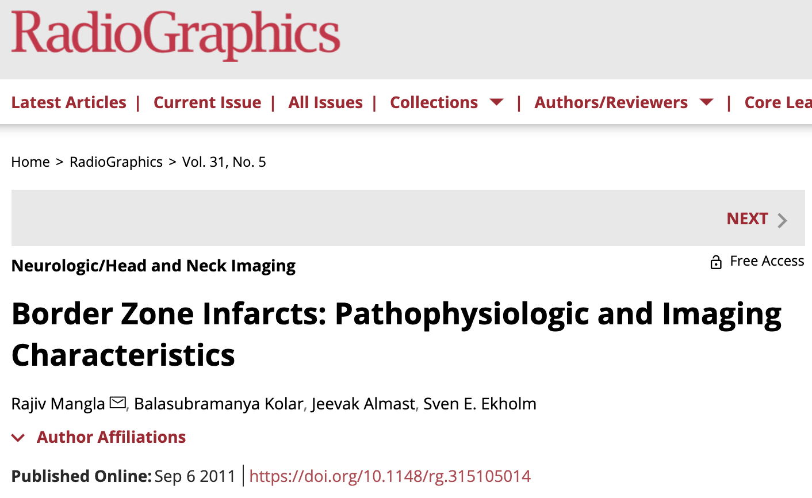
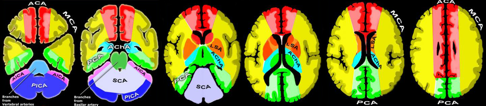
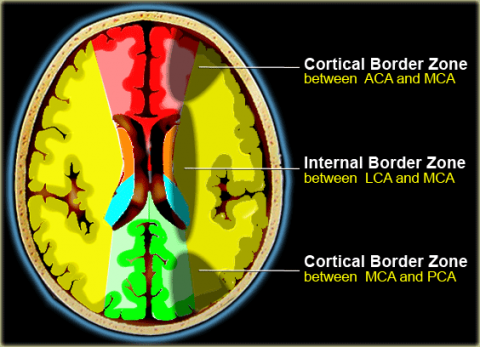
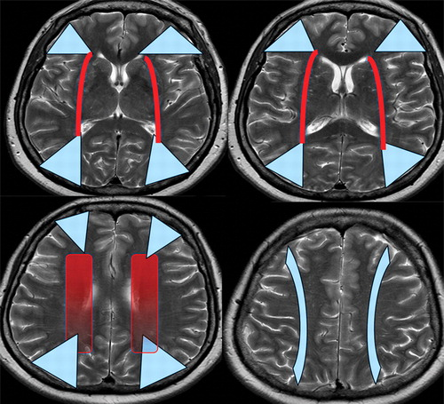
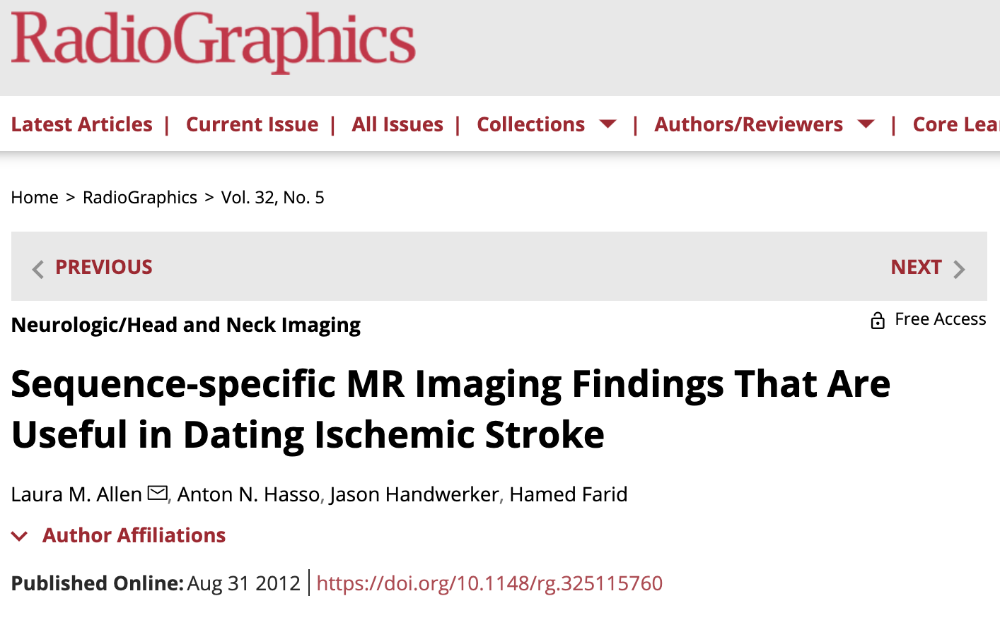
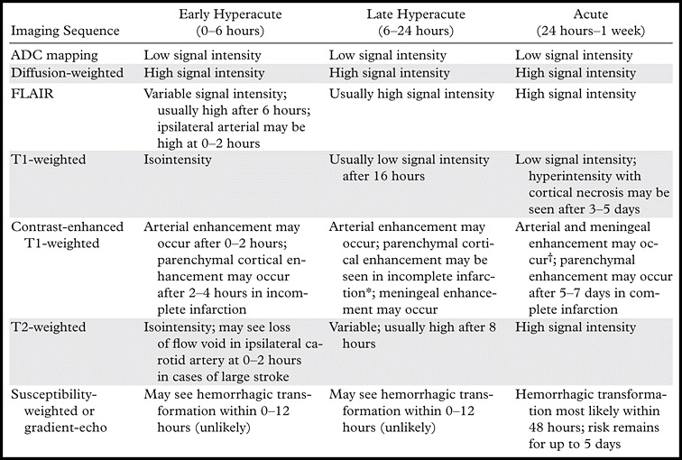
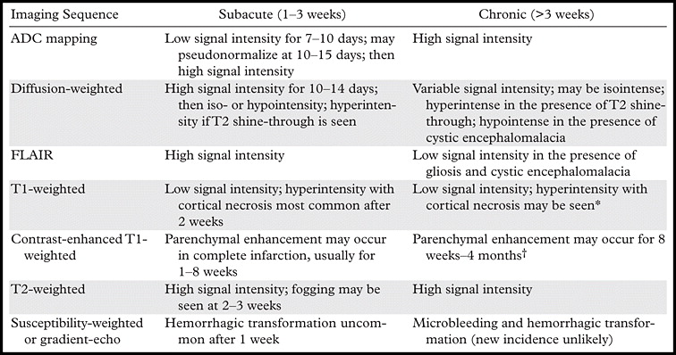
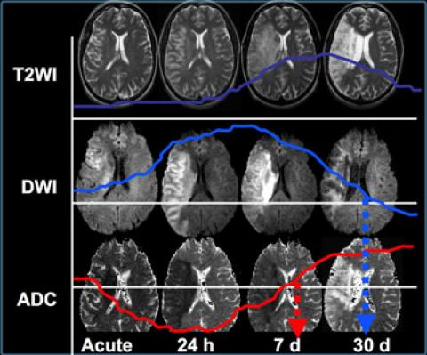

# More info

- Slides: [johncolby.github.io/infarcts](https://johncolby.github.io/infarcts)
- Repo: [github.com/johncolby/infarcts](https://github.com/johncolby/infarcts)

.center[

]

```{r xaringan-logo, echo=FALSE}
xaringanExtra::use_logo(
  image_url = "img/logo.png",
  link_url = 'https://www.mymarinhealth.org',
  position = xaringanExtra::css_position(bottom = "-3.5em", right = "1em")
)
```

```{r echo=FALSE}
xaringanExtra::use_webcam()
```

```{r xaringanExtra, echo = FALSE}
xaringanExtra::use_progress_bar(color = "#00994E", height="5px", location = "bottom")
```

---
class: center, middle, inverse
# Border zone vs. embolic infarcts

---
# Border zone vs. embolic infarcts

.pull-right[.middle-img[
[
```{r echo=FALSE, out.width="100%"}

```
](https://doi.org/10.1148/rg.315105014)
]]

---
# Vascular territories

[
```{r echo=FALSE}

```
](https://radiologyassistant.nl/neuroradiology/brain-ischemia/vascular-territories#cerebral-arterial-territory)

---
# Border zones

.pull-left[.middle-img[
[
```{r echo=FALSE}

```
](https://radiologyassistant.nl/neuroradiology/brain-ischemia/vascular-territories)
]]

.pull-right[.middle-img[
[
```{r echo=FALSE}

```
](https://doi.org/10.1148/rg.315105014)
]]

---
![:rad 2626, 6330]

---
![:rad 27611, 27823]

---
![:rad 49837, 55108]

---
class: center, middle, inverse
# Dating infarcts on MRI

---
# Dating infarcts on MRI

.pull-left[
- Early hyperacute (0–6 hours): ↑DWI, ↓ADC, T1 and FLAIR iso.
- Late hyperacute (6–24 hours): ↓T1, ↑FLAIR.
- Acute (1–7 days): Not well defined from late hyperacute.  
- Subacute (1–3 weeks): ADC *pseudo*normalization ~7 days, DWI takes longer.
- Chronic: ↑ADC, ↑T2, ↓FLAIR (cystic).
]

.pull-right[.middle-img[
[
```{r echo=FALSE, out.width="100%"}

```
](https://doi.org/10.1148/rg.325115760)
]]

---
.whole-block[].vmiddle[
[
```{r echo=FALSE, out.width="50%"}


```
](https://doi.org/10.1148/rg.325115760)
]

---
.center[
[
```{r echo=FALSE}

```
](https://radiologyassistant.nl/neuroradiology/brain-ischemia/imaging-in-acute-stroke)
]

---
![:rad 34695, 36125]
